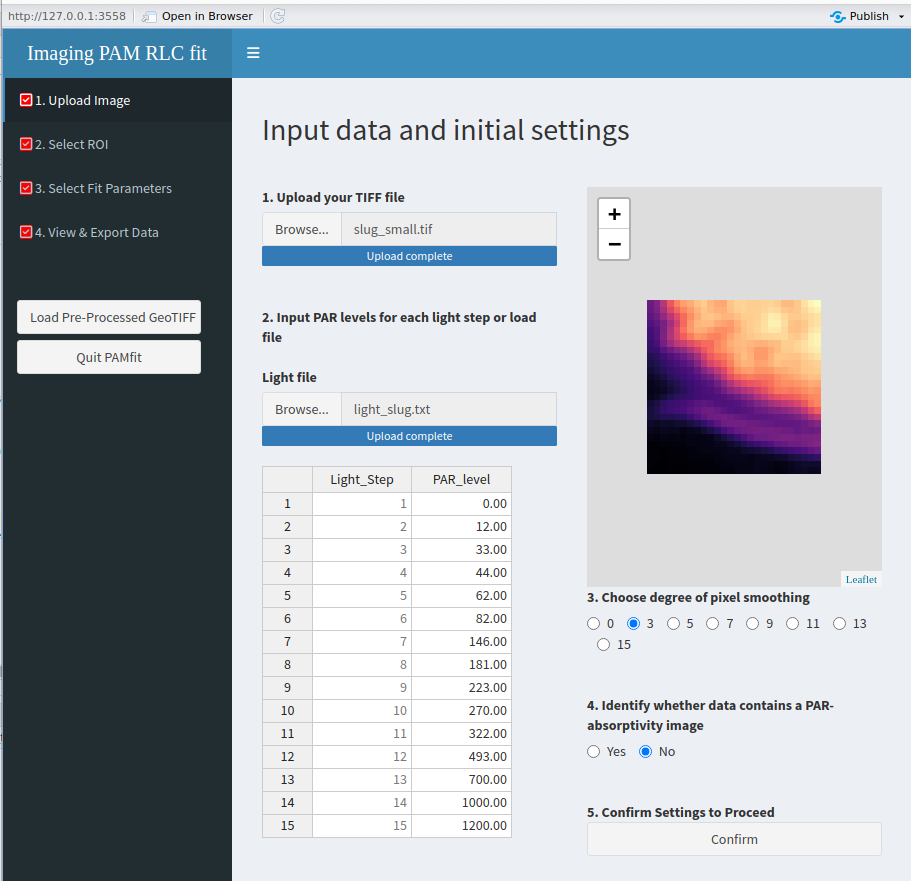
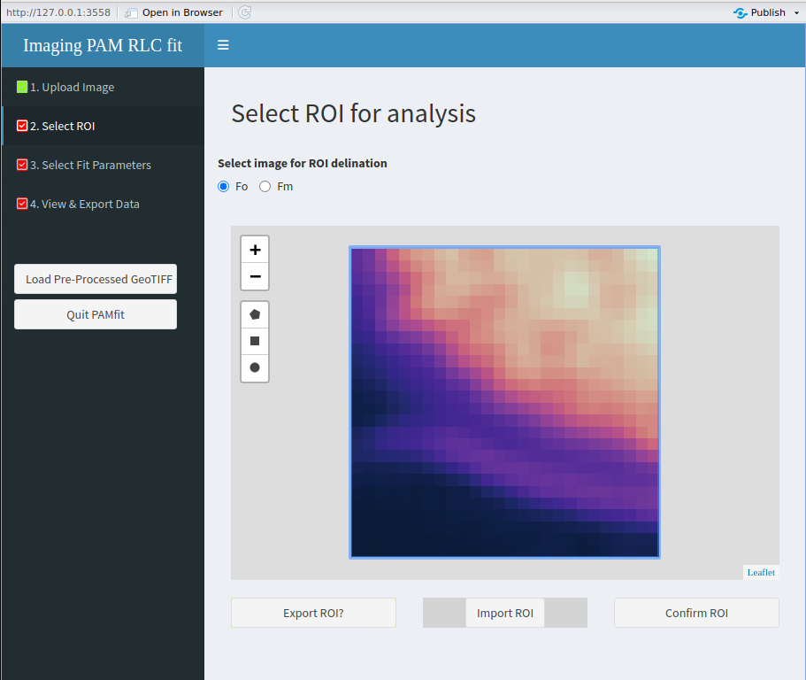
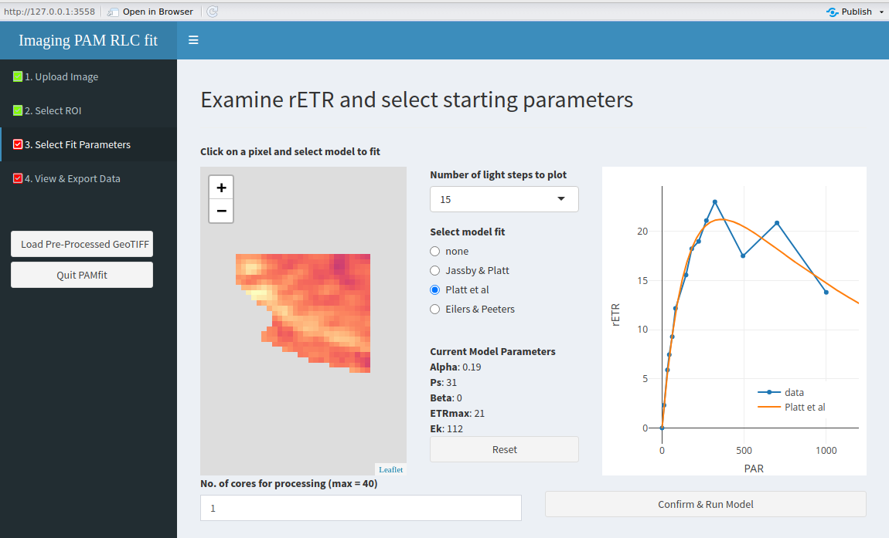
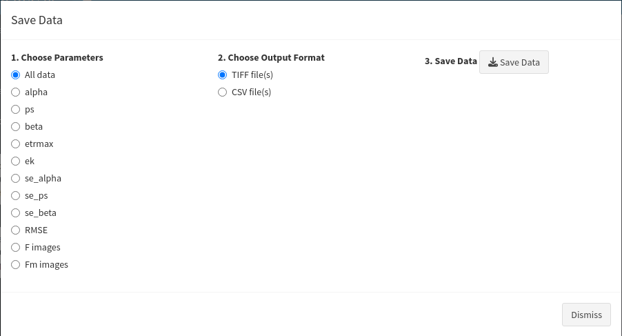
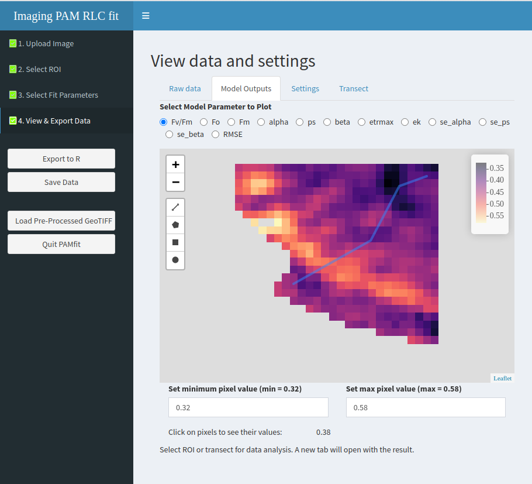
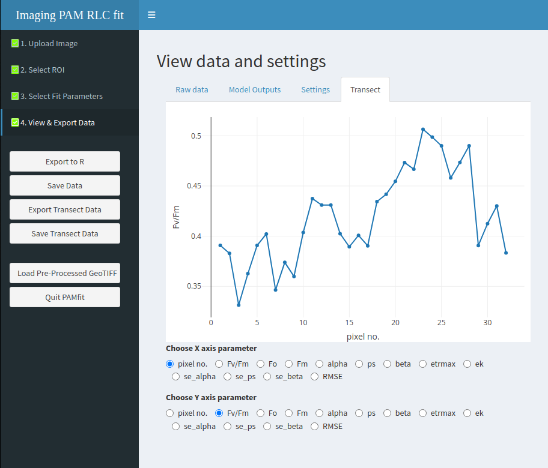
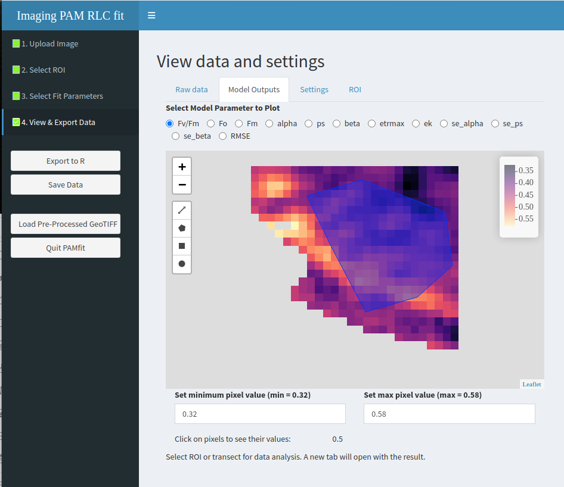
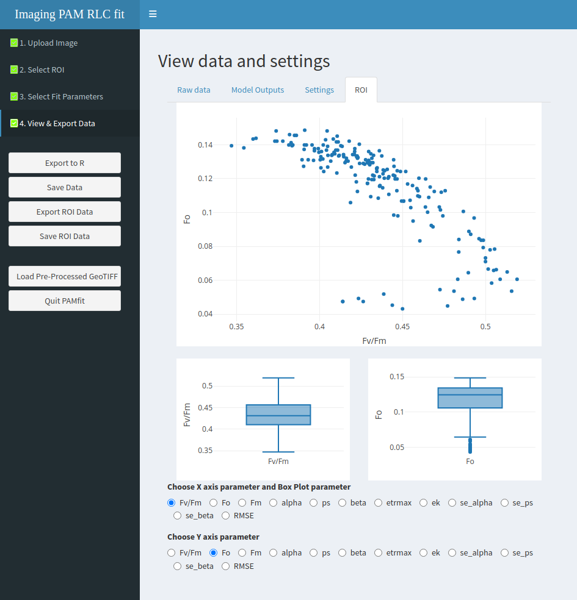
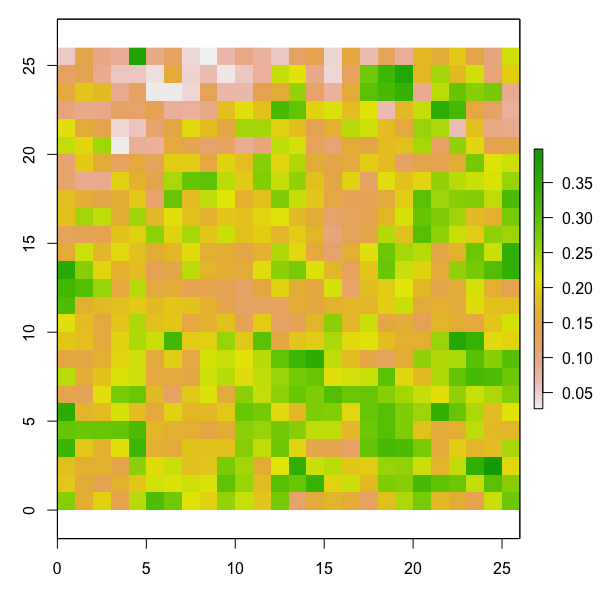
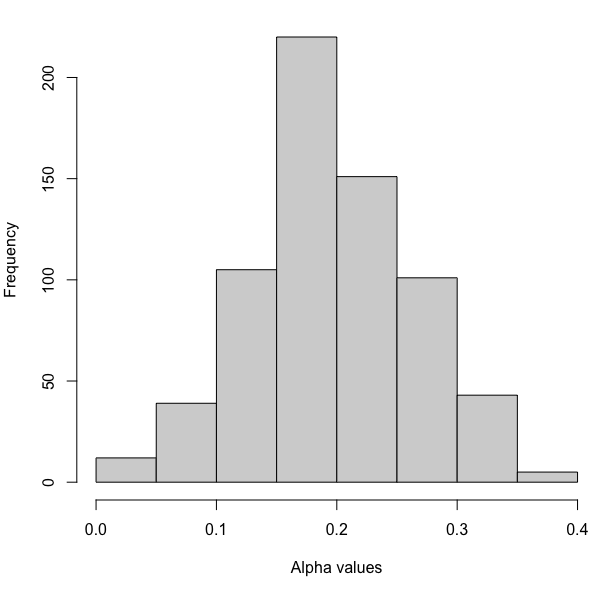

# User guide for pamfit: an R package for the study of photosynthesis-light curve parameters spatial heterogeneity.

<style>
.figure p.caption {
  margin-top: 12px; /* Space above caption */
}
</style>

This guide aims to assist users in extracting light-curve image
parameters —such as $\alpha$, E<sub>k</sub>, and rETR<sub>max</sub>—
from Imaging-PAM data using the `pamfit` R package. It serves as
supplementary material to the article *“PAMFIT: a new R package for
studying the spatial heterogeneity of photosynthesis–light curve
parameters”* by Jesus, B., Cartaxana, P., and Williamson, C. (submitted
to Limnology and Oceanography: Methods).

Sections 1 and 2 provide quick-start instructions for getting the
`pamfit` package up and running. Section 3 delves into more technical
aspects, including the structure of the data objects generated by
`pamfit`, details of the underlying calculations, and known limitations
of the package.

# Installing the package

The package is hosted on GitHub and can be installed using the
`install_github()` function from the `devtools` package.

If `devtools` is not already installed, it can be added using the
`install.packages()` function:

``` r
install.packages('devtools')
```

Once `devtools` is installed, you can install `pamfit` with the
following command:

``` r
devtools::install_github('bmjesus/pamfit') 
```

This command will download `pamfit` and install any required R package
dependencies. Depending on your current R setup, this process may take
some time. Some dependencies (e.g. `shiny`) have numerous additional
packages of their own.

# Testing pamfit

To start using`pamfit`, you first need to load it using:

``` r
library('pamfit') 
```

Then, run the `pamfit()` function in the R console to launch the Shiny
app.

``` r
pamfit()
```

## Upload data

`pamfit` requires two inputs: a `.tif` file exported from the Walz
ImagingWin software, and a list of the light levels used in the RLC. The
light levels can either be entered manually or provided in a simple
comma-separated text file. `pamfit` will save any light levels input and
hold these over if you continue to re-analyse the same image, or
different images that used the same PAR settings.

To get started, we recommend using one of the sample images provided to
test whether all functions are working correctly. Specifically, it’s a
good idea to begin with the smallest image (`slug_small.tif`, 676
pixels) along with its corresponding light levels file
(`light_slug_small.txt)`. Both files can be downloaded from the pamfit
GitHub repository
(<https://github.com/bmjesus/pamfit/tree/master/data>).

The first step in the workflow is to upload the `.tif` image file,
followed by the input of the PAR (photosynthetically active radiation)
levels, either manually or via a text file. The user may then optionally
select an image smoothing level to reduce pixel noise, and choose
whether to incorporate absorptivity values into the electron transport
rate (ETR) calculations. It is important to note that if
absorptivity-based ETR calculation is selected but the uploaded image
does not contain valid absorptivity data, all ETR images will be
returned as `NA`, and model fitting will not be possible. For guidance
on generating absorptivity images and exporting datasets in TIFF format,
refer to the Imaging PAM instruction manual.

After uploading, you should see something similar to the example below
([Figure 1](#fig01)):

<a id="fig01"></a>

<div class="figure" style="text-align: center">


<p class="caption">
First step: upload the data
</p>

</div>

Click `Confirm` to proceed to the next step.

## Select ROI

In this step, the user can define regions of interest (ROIs) on the
image using the digitization tools: polygon, rectangle, or circle.
Alternatively, it’s possible to click `Import ROI` to load a previously
saved ROI from an earlier analysis.

If you’re using `pamfit` for the first time, you’ll need to draw a new
ROI. In the example below ([Figure 2](#fig02)), we selected the entire
image as the ROI using the rectangle tool.

<a id="fig02"></a>

<div class="figure" style="text-align: center">


<p class="caption">
Second step: select ROI
</p>

</div>

Once you’ve finished selecting the ROI, click `Confirm ROI` to move to
the next step.

## Select fit parameters

In this step, the user needs to click on a pixel and select a fitting
model ([Figure 3](#fig03)). This allows pamfit to estimate suitable
starting values for the fitting algorithm. Optionally, the user can
reduce the number of light steps used by selecting a subset from the
drop-down menu. This can be especially useful when light curves include
many high-light levels that result in excessive photoinhibition.

This is also where the user can specify how many CPU cores to use for
the fitting process. For small images—such as the example provided—it is
best to leave the number of cores set to 1. For larger images (e.g.,
more than 15,000 pixels), increasing the number of cores can
significantly reduce processing time (see Jesus et al. for details). To
assist with this, `pamfit` automatically detects the number of available
cores. However, **do not** use all available cores, as this may cause
your system to crash.

<a id="fig03"></a>

<div class="figure" style="text-align: center">


<p class="caption">
Third step: select the model and the starting values
</p>

</div>

The fitting process begins when the user clicks the
`Confirm & Run Model` button. Once fitting is complete, the user will be
directed to the fourth and final step.

In our example, the test image runs extremely fast (under 2 seconds on
our system), but processing time for larger images may vary
significantly depending on factors such as operating system, number of
CPU cores, available memory, and processor speed. A progress bar is
provided to indicate the fitting process. However, please note that when
multiple CPU cores are used, the progress bar does not update in real
time. As long as the bar remains visible, the fitting is ongoing, please
be patient!

## View and export data

This is the most complex section of the app, and some menus in the left
panel dynamically change based on the tab selected by the user. The
section begins with three tabs — **Raw Data**, **Model Outputs**, and
**Settings** — and a fourth tab appears when the user selects ROIs or
transects for analysis.

By default, the app displays the **Raw Data** tab. In the left-hand
menu, the user can:

1.  **Export to R** – sends all current results to the R workspace  
    (see *Section 3* for details on the structure of the exported
    object).

2.  **Save Data** – allows exporting results outside of R in two
    formats: `.csv` and `.tif` (see [Figure 4](#fig04)).

    -   The `.csv` format can be opened in any spreadsheet or numerical
        software (e.g., OpenOffice, Excel).  
    -   The `.tif` format can be opened in imaging software (e.g.,
        ImageJ, QGIS), and includes all data layers: both the raw input
        and the fitted parameter outputs.  
        The structure of this `.tif` image mirrors that of the R object
        (*see Section 3*).

3.  **Load Pre-processed Image** – imports a previously saved `.tif` for
    further analysis.

4.  **Quit `pamfit`** – exits the app.

**Note:** All objects exported to the R workspace will only be available
**after** quitting `pamfit`.

<a id="fig04"></a>

<div class="figure" style="text-align: center">


<p class="caption">
Fourth step: saving data options
</p>

</div>

When the user selects the `Model Outputs` tab, they can draw either a
region of interest (ROI) or a transect on the resulting images using the
icons available for that purpose. Once this is done, a new tab will
appear –named either `ROI` or `Transect` depending on the user’s choice.
Upon entering the new tab, the left-hand menu will expand to offer
options for `exporting` (to the R workspace) or `saving` the data
associated with the selected ROI or transect.

The figures below illustrate an example of a transect ([Figure
5](#fig05)), and the corresponding output showing an
*F<sub>v</sub>/F<sub>m</sub>* gradient along the transect ([Figure
6](#fig06)).

**Important note:** Fitting models occasionally return extreme values
(outliers), which can distort image rendering by stretching the color
scale. It is not uncommon for an image to appear entirely black, which
can be caused by a single pixel with an extreme value. To correct this,
you can manually define the upper and lower limits of the parameter
being visualized. Clicking on a pixel in the image will return its
value, which can guide you in choosing appropriate limits.

<a id="fig05"></a>

<div class="figure" style="text-align: center">


<p class="caption">
Drawing a transect
</p>

</div>

<a id="fig06"></a>

<div class="figure" style="text-align: center">


<p class="caption">
Plotting the transect results
</p>

</div>

When the user selects an ROI ([Figure 7](#fig07)), the `ROI` tab
provides the option to plot two images against each other and displays a
boxplot analysis for each variable ([Figure 8](#fig08)).

<a id="fig07"></a>

<div class="figure" style="text-align: center">


<p class="caption">
Drawing a ROI
</p>

</div>

<a id="fig08"></a>

<div class="figure" style="text-align: center">


<p class="caption">
Boxplot and XY plot of ROI
</p>

</div>

# Technical details

## Exported R objects

The objects exported to the R workspace are of two types. The first type
are the results of the model fit and the second type are the result of
the ROI/Transect analysis. The latter are exported in a simple dataframe
format and the former in more complex list format described below.

When exporting the result to the workspace the user has the possibility
of changing the default name `pamfit_results` and once `pamfit` is
closed they will see the object appear on the workspace. The exported
object is a list with 5 elements, all items are of the type
`RasterBrick`. The 1st item contains all the minimum fluorescence images
(one per light level), the 2nd item contains the maximum fluorescence
images (one per light level), the 3rd the PSII quantum efficiency images
(one per light level), the 4th the ETR images (one per light level) and
the 5th contains the model parameters, their associated standard error
and RMSE images.

Note: if an Absorptivity measurements is used then the R list object has
eight elements, the first three being: “NIR”, “Red” and “abs”.

This the structure of an image processed with Eilers and Peeters (1988)
model using 13 light levels and no Absorptivity measurement.

    > str(pamfit_results)
    List of 5
    $ f_images      :Formal class 'RasterBrick' [package "raster"] with 13 slots
    $ fm_images     :Formal class 'RasterBrick' [package "raster"] with 13 slots
    $ Y[PSII]_images:Formal class 'RasterBrick' [package "raster"] with 13 slots
    $ ETR_images    :Formal class 'RasterBrick' [package "raster"] with 13 slots
    $ model_outputs :Formal class 'RasterBrick' [package "raster"] with 13 slots

Using the function `names()` will return the name of each image in the
respective list item.

    > names(pamfit_results$model_outputs)
    [1] "alpha"     "etrmax"    "eopt"      "Ek"        "se_alpha"  "se_etrmax" "se_eopt"   "RMSE"  

Plotting any image can be done by accessing the image using the
conventional R object structure (`$`). This is the example of how the
plot the `alpha` image ([Figure ?](#alpha)).

    terra::plot(pamfit_results$model_outputs$alpha)

<div class="figure" style="text-align: center">


<p class="caption">
Alpha image
</p>

</div>

Accessing the pixel values for numerical analysis can be done using the
`terra::values()` function. Here’s an example of how to plot the pixel
values distribution ([Figure ?](#alphahist)):

    hist(terra::values(pamfit_results$model_outputs$alpha))

<div class="figure" style="text-align: center">


<p class="caption">
Frequency of alpha pixel values
</p>

</div>

## Models and other calculations

### Fitting models

`pamfit` can fit three photosynthesis-irradiance models.

The simplest one is the model described in *Jassby, A.D., Platt, T.,
(1976) Mathematical formulation of the relationship between
photosynthesis and light for phytoplankton. Limnol. Oceanogr. 21:
540-547.* It is modeled with the following equation:


The second model is the one described in *Platt, T., Gallegos, C.L.,
Harrison, W.G. (1980) Photoinhibition of photosynthesis in natural
assemblages of marine phytoplankton. J. Mar. Res. 38, 687-701.*


The third model is the one described in *Eilers, P.H.C., and J.C.H.
Peeters. 1988. A model for the relationship between light intensity and
the rate of photosynthesis in phytoplankton. Ecological Modelling, 42,
199–215.* Modeled in `pamfit` using the equation:


All models are fitted using a Levenberg–Marquardt algorithm from the
function `minpack.lm::nlsLM` with the bounded, nonlinear least-squares
optimizer “PORT”.

### ETR calculations

Without absorptivity:

rETR = $\Phi$PSII x PAR x 0.5

With absorptivity:

rETR = $\Phi$PSII x PAR x 0.5 x Abs

Absorptivity is calculated as: Abs = 1 - red / nir

## Limitations and pitfalls

**Noise:** applying a small degree of smoothing consistently improved
the results in all the samples we processed, likely by reducing
electronic noise inherent to the image acquisition process. We recommend
that users identify the optimal smoothing level, i.e. the “sweet spot”,
where noise is minimized without significant loss of spatial
variability. In our samples, smoothing at three to five pixels
consistently enhanced the results without compromising spatial
structure.

**Starting values and choosing the right model:** the selection of model
parameter starting values plays a crucial role in the fitting process.
The PORT non-linear least-squares fitting algorithm demonstrated strong
robustness to high spatial variability. However, if an image contains
extreme differences in RLC response patterns, the selected pixel for the
initial parameter estimates may significantly influence the results. To
ensure consistency, we recommend that —if possible— samples with extreme
differences be analyzed separately, using distinct images rather than a
single composite image. This approach helps minimize potential biases
introduced by variations in starting values. Using a model that includes
a photoinhibition component (i.e., Platt or EP) consistently resulted in
lower global RMSE values. However, this came at the cost of increased
processing time, with the Platt model requiring more than twice the time
of the Jassby model. Therefore, if processing time is a limiting factor
and the dataset does not exhibit signs of photoinhibition, the Jassby
model can be used as a faster alternative. Otherwise, the Platt and EP
models generally provided better results.

**Slow speeds with high parallelization:** parallel processing is highly
beneficial for large images, significantly reducing processing time.
However, the greatest performance gains are observed between two and
four CPU cores. Beyond this, increasing the number of cores resulted in
only minor improvements or, in some cases, even slower processing. We
recommend that users test processing speed on their own systems to
determine the most efficient configuration. Memory limitations may occur
when running pamfit in parallel mode, particularly on Windows systems
where clusterR() launches multiple R sessions. Processing several images
in a single session without closing pamfit can also increase memory
usage, as RStudio retains objects until they are released to the
workspace when pamfit is closed. The safest approach is to run pamfit in
serial mode (one CPU core) and process one image per session. However,
in most systems we tested, using two cores was stable and halved
processing time.

**Rendering issues due to outliers:** fitting the P–I curve models may
occasionally produce infinite or extreme values. Infinite values are
handled internally by pamfit and excluded from calculations and image
rendering. However, extreme outliers are retained and can distort the
output by stretching the color scale, often resulting in mostly dark
images with isolated bright pixels. This is a visual artefact of the
outlier presence and can be manually compensated by the user by inputing
the minimum and maximum values in the colour range input boxes. Finding
the pixel values can be easily done by clicking on the image with the
mouse.

**Opening processed TIFF files:** this functionality relies on the
`terra::metags` function, which generates the metadata associated with
each data layer. In the current `pamfit` version, the `metags` function
used to open processed files must be the same version that was used to
generate them.
